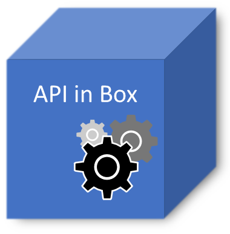

# API in a Box
The goal of this project is to have a "ready to go" API back-end service with all necessary features in order to scale web development. 

Features include:
- Token generation and validation 
- Authentication and authorization
- ORM EF Core + PostgreSql backend along with concurrency handling
- API key registration
- User registration and mail activation support
- NodaTime support
- HTTPS (TLS)
- Logging (file and console) with Serilog
- Works well with [Web App In A Box](https://github.com/hirre/webapp-in-a-box)
- and more...

## Create a self signed certificate

1) Install [OpenSSL](https://www.openssl.org)

2) Run and enter a key/certificate password along with other credentials:
```
openssl req -x509 -newkey rsa:4096 -keyout privateKey.pem -out certificate.pem -days 10000
openssl pkcs12 -export -out ServerCertificate.pfx -inkey privateKey.pem -in certificate.pem
```

Put "ServerCertificate.pfx" ("https_certificate" field in "src/ApiService/appsettings.json") in the "src/ApiService/" folder (it will automatically be copied to the binary output folder). Set the "https_certificate_password" field to your password and change the token key to something unique and hard to guess.

## PostgreSql
Download and install PostgreSql: https://www.postgresql.org/download/

Change the connection string in "src/ApiService/appsettings.json" to your setup.

## Reverse proxy
It is recommended to have Kestrel running behind a reverse proxy, e.g. Nginx.

Guide: https://docs.microsoft.com/en-us/aspnet/core/fundamentals/servers/kestrel?view=aspnetcore-5.0#when-to-use-kestrel-with-a-reverse-proxy

## More info
https://docs.microsoft.com/en-us/aspnet/core/?view=aspnetcore-5.0

