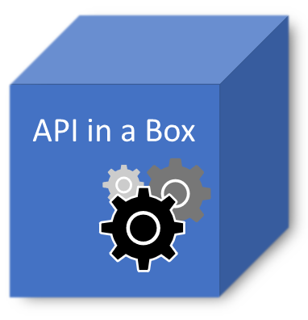

# API in a Box
The goal of this project is to have a "ready to go" API back-end service with all necessary features in order to scale web development. 

Features include:
- Token generation and validation 
- Authentication and authorization
- ORM EF Core + PostgreSql backend along with concurrency handling
- API key registration
- User registration
- HTTPS (TLS)
- Logging (file and console) with Serilog
- and more...

## Create a self signed certificate
Guide: https://docs.microsoft.com/en-us/dotnet/core/additional-tools/self-signed-certificates-guide

Export the certificate to a file called "ServerCertificate.pfx" and put it in the "src/ApiService/" folder (it will automatically be copied to the binary output folder).

## PostgreSql
Download: https://www.postgresql.org/download/

Download and install PostgreSql

Change the connection string at the bottom of the file in "src/ApiService/appsettings.json" to your setup.
